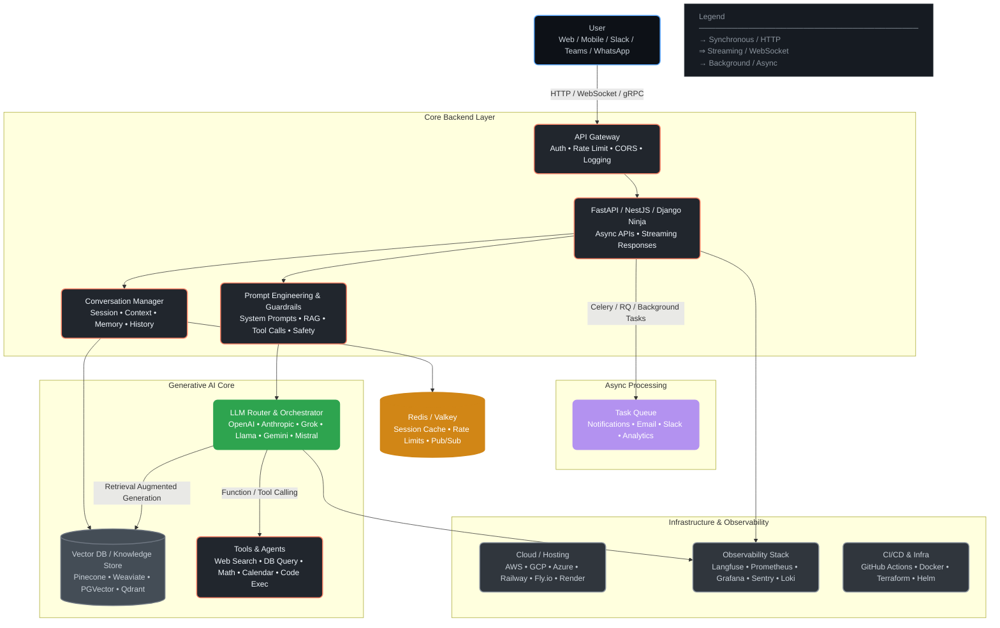

<div align="center">
  
  <br><br>

  
  
  
  

  <br><br>
  <strong>Production-style • Modular • AI-ready • Dockerized</strong>
</div>

<br>

# Generative AI Support Assistant Backend

[](https://www.python.org/)
[](https://fastapi.tiangolo.com/)
[](https://www.docker.com/)
[](https://opensource.org/licenses/MIT)

**Modern FastAPI backend simulating intelligent customer support powered by generative AI**  
(fully offline mock layer – production-ready architecture – easy path to real LLM)

Showcases:
- Clean layered architecture & service abstraction
- Mock AI with keyword intent detection (refund, delivery, login, complaint…)
- Structured logging + correlation IDs
- Pydantic-powered config & validation
- Docker multi-stage build + compose support
- Automatic Swagger/ReDoc documentation

Ideal for:
- Learning enterprise FastAPI patterns
- AI-integrated backend portfolio projects
- Prototyping real customer support agents without API costs

## ✨ Key Features

- REST API built with **FastAPI** (automatic OpenAPI/Swagger docs)
- Clean layered architecture (`routes` → `services` → `utils`)
- **Mocked AI engine** using keyword-based intent detection — **zero external dependencies**
- Service abstraction layer — **easy to swap mock → real LLM** (OpenAI, Azure, Anthropic, Gemini…)
- Structured logging with correlation IDs
- Type-safe configuration via **Pydantic Settings**
- Multi-stage **Dockerfile** + **docker-compose** support
- Ready for future extensions: auth, persistence, conversation memory

## 🏗 Modern Architecture Overview 



## 📁 Project Structure

```text
ai-support-backend/
├── app/
│   ├── __init__.py
│   ├── main.py               # FastAPI app entry point
│   ├── config.py             # Typed environment settings
│   ├── routes/
│   │   ├── __init__.py
│   │   └── support.py        # /api/support endpoint
│   ├── services/
│   │   ├── __init__.py
│   │   └── ai_service.py     # Mock AI intent classifier
│   └── utils/
│       ├── __init__.py
│       └── logger.py         # Logging configuration
├── screenshots/              # Demo screenshots
│   ├── swagger-ui.png
│   ├── post-request.png
│   ├── api-response.png
│   ├── terminal-logs.png
│   └── docker-run.png
├── .env.example
├── .gitignore
├── requirements.txt
├── Dockerfile
├── docker-compose.yml
└── README.md
```

## 🛠 Tech Stack

| Layer              | Technology                  | Purpose                                      |
|--------------------|-----------------------------|----------------------------------------------|
| Framework          | FastAPI                     | Async API, auto docs, validation             |
| Server             | Uvicorn                     | Production-grade ASGI server                 |
| Validation/Settings| Pydantic v2                 | Type-safe models & config                    |
| Logging            | Python logging              | Structured + correlation IDs                 |
| Containerization   | Docker & Docker Compose     | Consistent dev → prod environments           |
| Language           | Python 3.10+                | Modern syntax & performance                  |

## 🚀 Quick Start (Local Development)

```bash
# 1. Clone the repository
git clone https://github.com/Biradarmahadev/Generative-AI-Support-Assistant-Backend.git
cd Generative-AI-Support-Assistant-Backend

# 2. Create and activate virtual environment
python -m venv venv
source venv/bin/activate          # Linux/macOS
# venv\Scripts\activate           # Windows cmd
# source venv/Scripts/activate    # Windows Git Bash

# 3. Install dependencies
pip install -r requirements.txt

# 4. (optional) Copy example env file
cp .env.example .env

# 5. Start the server (auto-reload enabled)
uvicorn app.main:app --reload --port 8000
```

API Documentation:  
→ http://127.0.0.1:8000/docs (Swagger UI)  
→ http://127.0.0.1:8000/redoc (ReDoc)

## 📌 API Usage Example

**POST** `/api/support`

**Request Body**
```json
{
  "message": "I want a refund for my order"
}
```

**Response**
```json
{
  "response": "Sure! Please share your order ID to process your refund request."
}
```

## 🤖 AI Service (Mocked – Offline & Free)

The AI layer uses **keyword-based intent detection** to simulate generative behavior:

- Detects intents: refund, delivery status, login issue, complaint, order tracking…
- Returns contextual, helpful responses
- No external API calls → zero cost & fully offline
- Designed for **easy upgrade** → replace mock with real LLM (OpenAI, Grok, Llama, etc.)

## 🐳 Docker Support

### Build & Run Single Container

```bash
docker build -t ai-support-backend .
docker run -p 8000:8000 ai-support-backend
```

### Using Docker Compose

```bash
docker-compose up --build
```

## 📸 Screenshots

Check the `screenshots/` folder for visuals:
- Swagger UI interface
- Sample API request/response
- Terminal logs with correlation IDs
- Docker container running

## 🔐 Environment Variables (.env)

```env
APP_NAME=AI Support Assistant Backend
ENV=development
LOG_LEVEL=INFO
```

## 📈 Future Enhancements

- Real LLM integration (OpenAI / Grok / Llama / Gemini)
- JWT authentication & user sessions
- Persistent chat history (PostgreSQL / MongoDB)
- RAG support with vector database
- Rate limiting & API security
- CI/CD pipeline (GitHub Actions)

## 👤 Author

**Mahadev**  
Backend Developer | Python | FastAPI | AI-Integrated Systems | Bengaluru

## 📄 License

MIT License – feel free to use, modify, and learn from this project!

<div align="center">
  <br/>
  
</div>
```


